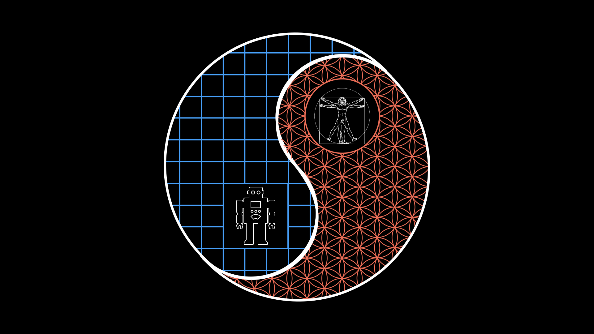

# ComplicatedVsComplex

## Title:

Complicated vs Complex - the missing Distinction for navigating the Anthropocene

## Description:

What is the difference between the systems found in nature and those produced by the human intellect?
How can a deeper insight into this dichotomy help us to build a more resilient and balanced civilisation? 

--------------------------------------------------------------------------------------------------------- 
Please help me do this full time: https://patreon.com/ProjectLiminality

If you want your own story to be told in my unique style check out my Liminal Consulting service: https://projectliminality.github.io/LiminalConsultingWeb3/

---------------------------------------------------------------------------------------------------------

Inspiration: https://www.youtube.com/watch?v=su91uPR_jmM

# Script:

